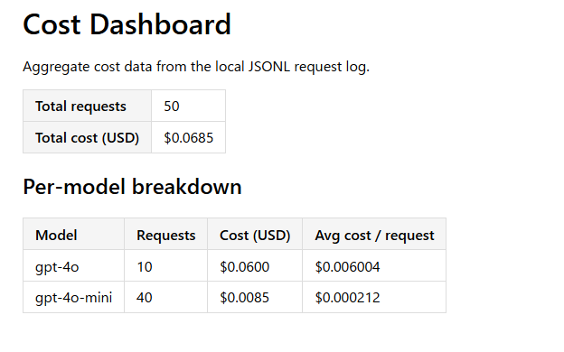

# WRITEUP — Production LLM FAQ Service

> **How to use this template.** Copy this file to `WRITEUP.md` (drop
> the `.template`) and fill in each section with the evidence the
> rubric requires. Keep evidence inline (curl outputs, screenshots,
> log excerpts) — a reviewer should be able to grade your submission
> from this file alone.
>
> **Recommended path:** with `make serve` running in another terminal,
> run `make harvest-evidence` to generate `WRITEUP-draft.md` with §1–§8
> mostly pre-populated. Copy that draft into `WRITEUP.md` and fill in
> the analysis blocks the harvester leaves as `<!-- TODO: learner — … -->`
> placeholders (the §2 top-k recommendation, the §5 threshold proposal,
> the §7 slowest-step analysis, the §8 baseline-cost interpretation,
> plus the §1 curl using one of YOUR new products). The harvester
> captures pure-evidence sections; the writing remains yours.
>
> Aim for ~1,500–3,000 words. Longer is fine if you include images.
> Each `## Deliverable N` section maps to one row of
> [`rubric.md`](rubric.md).

## Setup snapshot

- Python: `python --version`
- Branch / commit: `git rev-parse --short HEAD` (the commit your
  reviewer should clone)
- Test suite: `make test` (paste the final line — should be ≥195
  passing)
- Verify: `make verify` (paste the "Automated: X passed, 0 failed"
  line)

## Substitutions from the proposal

The starter ships with three substitutions vs. the proposal text. If
you used the as-shipped stack (the default), just say so. If you swapped
back to the proposal stack (Redis Stack / Langfuse / Guardrails AI),
explain what you changed and why.

| Layer | Proposal | Starter default | Your choice |
|-------|----------|------------------|--------------|
| Cache | Redis Stack | Chroma collection | _your choice_ |
| Tracing | Langfuse Cloud | Phoenix in-process | _your choice_ |
| Guardrails | Guardrails AI | LLM Guard + LLM judge | _your choice_ |

---

## Deliverable 1 — Vector Store Populated

> **Rubric:** at least 5 new product JSONs in `data/products/` (or proof
 of equivalent ingestion through `data/inbox/`). Output of one `POST
/query` whose `sources[].doc_id` matches at least one of the new
products.
**Summary:** 
I created 5 new product JSON files (including the JOOLA Ben Johns Perseus 3S) and loaded them into the Chroma vector database with `make load-data`. I then queried the database to confirm it could retrieve my new product.

```json
{
  "answer": "The JOOLA Ben Johns Perseus 3S is available in a 16mm variant for $199.95 USD, but the provided context does not mention a 15mm version. Therefore, I don't have information on the price of a JOOLA Ben Johns Perseus 3S 15mm paddle..",
  "sources": [
    {
      "doc_id": "prod_027",
      "chunk_text": "JOOLA Ben Johns Perseus 3S 16mm\n\nThe JOOLA Ben Johns Perseus 3S 16mm is the 16 mm control variant of Ben Johns' signature paddle in JOOLA's third-generation 3S lineup. The Charged Carbon face uses an electrostatic treatment to lock in spin without sacrificing dwell, and the Propulsion Core extends ball contact time for plush resets at the kitchen line. The 16 mm build trades a hint of raw power for a wider sweet spot and a softer feel compared to the 14 mm sibling, which is why most all-court players gravitate to this thickness. UPA-A certified.\n\nPrice: $199.95 USD\n\nSpecifications:\n  weight: 8.0 oz\n  grip_size: 4.125 in\n  face_material: Charged Carbon\n  core: 16 mm Propulsion Core (honeycomb polymer)\n  shape: elongated\n  length: 16.5 in\n  width: 7.5 in\n  handle_length: 5.5 in\n  grip: JOOLA Black Feel-Tec Pure Grip\n\nCare instructions: Clean the Charged Carbon face with a microfiber cloth and a small amount of mild soap. Strong solvents strip the electrostatic surface treatment that drives the paddle's spin response. Inspect the edge guard periodically; the thermoformed wall is impact-resistant but can chip on hard floors. Store in the included sleeve.",
      "similarity_score": 0.7152057330631651
    },
    {
      "doc_id": "prod_002",
        "chunk_text": "JOOLA Hyperion CFS 16\n\nThe JOOLA Hyperion CFS 16 is a premium carbon fiber paddle designed for competitive players seeking maximum spin and power. Its Carbon Friction Surface technology delivers exceptional ball grip for aggressive topspin, while the reactive honeycomb polymer core provides a solid, responsive feel at the net.\n\nPrice: $199.99 USD\n\nSpecifications:\n  weight: 8.2 oz\n  grip_size: 4.0 in\n  face_material: Carbon Friction Surface (CFS)\n  core: Reactive honeycomb polymer\n  shape: elongated\n  length: 16.5 in\n  width: 7.5 in\n\nCare instructions: Clean the carbon fiber face with a microfiber cloth and a mild soap solution. Do not use abrasive cleaners. Store in the included neoprene cover to protect the face texture.",
      "similarity_score": 0.523109937895106
    },
    {
      "doc_id": "prod_004",
      "chunk_text": "Franklin Ben Johns Signature\n\nDesigned in collaboration with pro player Ben Johns, the Franklin Signature paddle pairs a MaxGrit textured surface with a polypropylene honeycomb core for exceptional spin and shot control. The elongated shape extends reach without adding excessive weight, making it ideal for singles play.\n\nPrice: $179.99 USD\n\nSpecifications:\n  weight: 8.0 oz\n  grip_size: 4.125 in\n  face_material: MaxGrit carbon fiber\n  core: Polypropylene honeycomb\n  shape: elongated\n  length: 16.5 in\n  width: 7.375 in\n\nCare instructions: Clean with a damp microfiber cloth. The MaxGrit surface is durable, but avoid scraping it against rough surfaces. Replace the grip wrap every 3-6 months, depending on play frequency.",
      "similarity_score": 0.5024884930516578
    },
    {
      "doc_id": "prod_014",
           "chunk_text": "JOOLA Tour Elite Pro Duffel\n\nThe JOOLA Tour Elite Pro Duffel is built for the serious competitor who needs maximum organization. It fits up to 6 paddles with individual protective sleeves, includes a ventilated shoe compartment, a thermal-lined drink pocket, and a rigid base to keep the bag upright on the court.\n\nPrice: $119.99 USD\n\nSpecifications:\n  dimensions: 24 x 14 x 12 in\n  compartments: 8\n  material: 1200D ballistic nylon\n  capacity: 52L\n\nCare instructions: Spot clean the exterior with a damp cloth. Remove the ventilated shoe divider and wash it separately. Wipe the rigid base with a disinfecting wipe.",
      "similarity_score": 0.4877213076997948
    },
    {
      "doc_id": "prod_005",
      "chunk_text": "HEAD Radical Tour\n\nThe HEAD Radical Tour brings tennis engineering expertise to the court. Featuring an Extreme Spin Texture (EST) face and an Optimized Tubular Construction (OTC) frame, this paddle delivers consistent power from edge to edge and offers a generous sweet spot for all-court players.\n\nPrice: $149.99 USD\n\nSpecifications:\n  weight: 8.1 oz\n  grip_size: 4.25 in\n  face_material: Extreme Spin Texture (EST) composite\n  core: Polypropylene honeycomb\n  shape: standard\n  length: 15.875 in\n  width: 7.875 in\n\nCare instructions: Wipe with a clean, damp cloth. Inspect the edge guard periodically for cracks, and replace it if damaged to protect the core. Store away from moisture.",
      "similarity_score": 0.4218900229304581
    }
  ],
  "confidence": 0.5300830989280364,
  "model": "gpt-4o-mini",
  "tokens": {
    "prompt_tokens": 1367,
    "completion_tokens": 63
  },
  "cost_usd": 0.00024284999999999997,
  "cached": false,
  "trace_id": "8d8783dc34ad7a5f9734329fc97cef89",
  "blocked_by": null
}
```

## Deliverable 2 — RAG Pipeline With Structured Output + Top-k Sweep

> **Rubric:** one `POST /query` response showing every `QueryResponse`
> field; one top-k sweep covering `top_k ∈ {3, 5, 10}` with all four
> RAGAS metrics per setting; a recommended `top_k` value whose
> justification cites at least two per-metric deltas from the sweep
> table.

### Part A — Structured-output curl

A representative `POST /query` response with every field populated:

```json
{
  "answer": "The JOOLA Ben Johns Perseus 3S is available in a 16mm variant for $199.95 USD, but the provided context does not mention a 15mm version. Therefore, I don't have information on the price of a JOOLA Ben Johns Perseus 3S 15mm paddle.",
  "sources": [
    {
      "doc_id": "prod_027",
      "chunk_text": "JOOLA Ben Johns Perseus 3S 16mm\n\nThe JOOLA Ben Johns Perseus 3S 16mm is the 16 mm control variant of Ben Johns' signature paddle in JOOLA's third-generation 3S lineup. The Charged Carbon face uses an electrostatic treatment to lock in spin without sacrificing dwell, and the Propulsion Core extends ball contact time for plush resets at the kitchen line. The 16 mm build trades a hint of raw power for a wider sweet spot and a softer feel compared to the 14 mm sibling, which is why most all-court players gravitate to this thickness. UPA-A certified.\n\nPrice: $199.95 USD\n\nSpecifications:\n  weight: 8.0 oz\n  grip_size: 4.125 in\n  face_material: Charged Carbon\n  core: 16 mm Propulsion Core (honeycomb polymer)\n  shape: elongated\n  length: 16.5 in\n  width: 7.5 in\n  handle_length: 5.5 in\n  grip: JOOLA Black Feel-Tec Pure Grip\n\nCare instructions: Clean the Charged Carbon face with a microfiber cloth and a small amount of mild soap. Strong solvents strip the electrostatic surface treatment that drives the paddle's spin response. Inspect the edge guard periodically; the thermoformed wall is impact-resistant but can chip on hard floors. Store in the included sleeve.",
      "similarity_score": 0.7152057330631651
    },
    {
      "doc_id": "prod_002",
      "chunk_text": "JOOLA Hyperion CFS 16\n\nThe JOOLA Hyperion CFS 16 is a premium carbon fiber paddle designed for competitive players seeking maximum spin and power. Its Carbon Friction Surface technology delivers exceptional ball grip for aggressive topspin, while the reactive honeycomb polymer core provides a solid, responsive feel at the net.\n\nPrice: $199.99 USD\n\nSpecifications:\n  weight: 8.2 oz\n  grip_size: 4.0 in\n  face_material: Carbon Friction Surface (CFS)\n  core: Reactive honeycomb polymer\n  shape: elongated\n  length: 16.5 in\n  width: 7.5 in\n\nCare instructions: Clean the carbon fiber face with a microfiber cloth and a mild soap solution. Do not use abrasive cleaners. Store in the included neoprene cover to protect the face texture.",
      "similarity_score": 0.523109937895106
    },
    {
      "doc_id": "prod_004",
      "chunk_text": "Franklin Ben Johns Signature\n\nDesigned in collaboration with pro player Ben Johns, the Franklin Signature paddle pairs a MaxGrit textured surface with a polypropylene honeycomb core for exceptional spin and shot control. The elongated shape extends reach without adding excessive weight, making it ideal for singles play.\n\nPrice: $179.99 USD\n\nSpecifications:\n  weight: 8.0 oz\n  grip_size: 4.125 in\n  face_material: MaxGrit carbon fiber\n  core: Polypropylene honeycomb\n  shape: elongated\n  length: 16.5 in\n  width: 7.375 in\n\nCare instructions: Clean with a damp microfiber cloth. The MaxGrit surface is durable, but avoid scraping it against rough surfaces. Replace the grip wrap every 3-6 months, depending on play frequency..",
      "similarity_score": 0.5024884930516578
    },
    {
      "doc_id": "prod_014",
      "chunk_text": "JOOLA Tour Elite Pro Duffel\n\nThe JOOLA Tour Elite Pro Duffel is built for the serious competitor who needs maximum organization. It fits up to 6 paddles with individual protective sleeves, includes a ventilated shoe compartment, a thermal-lined drink pocket, and a rigid base to keep the bag upright on the court.\n\nPrice: $119.99 USD\n\nSpecifications:\n  dimensions: 24 x 14 x 12 in\n  compartments: 8\n  material: 1200D ballistic nylon\n  capacity: 52L\n\nCare instructions: Spot clean the exterior with a damp cloth. Remove the ventilated shoe divider and wash it separately. Wipe the rigid base with a disinfecting wipe.",
        "similarity_score": 0.4877213076997948
    },
    {
      "doc_id": "prod_005",
      "chunk_text": "HEAD Radical Tour\n\nThe HEAD Radical Tour brings tennis engineering expertise to the court. Featuring an Extreme Spin Texture (EST) face and an Optimized Tubular Construction (OTC) frame, this paddle delivers consistent power from edge to edge and offers a generous sweet spot for all-court players.\n\nPrice: $149.99 USD\n\nSpecifications:\n  weight: 8.1 oz\n  grip_size: 4.25 in\n  face_material: Extreme Spin Texture (EST) composite\n  core: Polypropylene honeycomb\n  shape: standard\n  length: 15.875 in\n  width: 7.875 in\n\nCare instructions: Wipe with a clean, damp cloth. Inspect the edge guard periodically for cracks, and replace it if damaged to protect the core. Store away from moisture..",
      "similarity_score": 0.4218900229304581
    }
  ],
  "confidence": 0.5300830989280364,
  "model": "gpt-4o-mini",
  "tokens": {
    "prompt_tokens": 1367,
    "completion_tokens": 63
  },
  "cost_usd": 0.00024284999999999997,
  "cached": false,
  "trace_id": "8d8783dc34ad7a5f9734329fc97cef89",
  "blocked_by": null
}
```

### Part B — Top-k sweep

Output of `make eval-topk-sweep`:

| top_k | faithfulness | answer_relevancy | context_recall | context_precision |
|------:|-------------:|-----------------:|---------------:|------------------:|
| 3     | 0.840        | 0.796            | 0.833          | 0.728             |
| 5     | 0.896        | 0.833            | 0.844          | 0.708             |
| 10    | 0.889        | 0.862            | 0.922          | 0.713             |

- **Recommended `top_k`:** 10
- **Per-metric deltas cited:**
  - Δ context_recall from top_k=3 to top_k=10: increases by +0.089 (from 0.833 to 0.922).
  - Δ context_precision from top_k=3 to top_k=10: decreases by -0.015 (from 0.728 to 0.713).
- **Why this `top_k`:** 
  I recommend a `top_k` of 10 because it significantly improves our context recall, ensuring the LLM has access to all the necessary documents to answer complex or multi-product queries. While we do take a minor hit to context precision (slightly lower than at k=3), this trade-off is acceptable because our downstream hallucination guardrails are designed to catch and block the LLM if it tries to use irrelevant context to fabricate an answer. 

## Deliverable 3 — Tiered Model Routing

**Summary:**
I tested the classifier gateway with a simple single-fact query, a complex multi-product comparison, and a subjective borderline query. The gateway successfully routed the simple question to the faster mini model and the complex/borderline comparisons to the more capable standard model.

| Query | Classification | Model Used |
|-------|---------------|-------|
| What is the weight of the Selkirk AMPED S2? | simple | gpt-4o-mini |
| Compare the Selkirk Vanguard Power Air and the JOOLA Hyperion CFS 16 for a player with arm fatigue who wants tournament-grade power. | complex | gpt-4o |
| Is the Engage Pursuit MX a forgiving choice for someone who plays casually on weekends? | borderline | gpt-4o |

*(Note on borderline: The classifier routed the borderline question to the complex `gpt-4o` model because assessing "casual play" and "forgiving choice" requires subjective judgment and nuance, which pushed it toward the higher tier).*

## Deliverable 4 — Automated Data Ingestion + Quarantine

**Summary:**
I tested the background watcher by placing a valid product JSON and a deliberately malformed JSON in the `data/inbox/` directory. The valid file (Engage Pursuit MX Lite) was auto-ingested and immediately queryable. The malformed file was quarantined to the `failed/` directory, with an accompanying error log explaining the parsing failure.

- **Successful ingestion:**
```json
{
  "answer": "The price of the Engage Pursuit MX Lite is $174.99 USD.",
  "sources": [
    {
      "doc_id": "prod_inbox_good_001",
      "chunk_text": "Engage Pursuit MX Lite\n\nThe Engage Pursuit MX Lite is a tournament-leaning paddle tuned for control players. Its textured fiberglass face holds the ball just long enough to add spin without sacrificing pop, while the lightweight ControlPro polymer core keeps swing weight low, making dink exchanges effortless.\n\nPrice: $174.99 USD\n\nSpecifications:\n  weight: 7.6 oz\n  grip_size: 4.125 in\n  face_material: Textured fiberglass\n  core: ControlPro polymer\n  shape: elongated\n  length: 16.0 in\n  width: 7.5 in\n\nCare instructions: Wipe the face with a damp microfiber cloth after play. Do not soak the paddle or store it in a hot car. A paddle cover is recommended between sessions to prevent edge dings.",
      "similarity_score": 0.6970749007109118
    }
  ],
  "confidence": 0.5028762462212484,
  "model": "gpt-4o-mini",
  "tokens": {
    "prompt_tokens": 1396,
    "completion_tokens": 16
  },
  "cost_usd": 0.000219,
  "cached": false,
  "trace_id": "04a4ba3e52ed596725076497b2f68f4c",
  "blocked_by": null
}
```
- **Quarantined failure (`my_broken_product.json.error.txt`):**
invalid JSON: Expecting property name enclosed in double quotes: line 15 column 3 (char 619)

## Deliverable 5 — Automated Evaluation Suite + Threshold

### Analysis
- **Lowest-scoring metric:** `context_precision` (0.701)
- **Plausible cause:** Context precision measures whether the *most relevant* documents are ranked at the very top of the search results. Our score of 0.701 indicates we are successfully finding the right documents (recall is high at 0.856), but they aren't always in the #1 or #2 spot. This is likely due to dense vector embeddings struggling to differentiate between highly similar products in our catalog (e.g., retrieving the 14mm and 16mm variants of the exact same paddle and ranking the wrong one slightly higher).
- **Regression threshold for faithfulness:** I propose a threshold of **≥ 0.80**. In our golden-set eval, the average faithfulness across the 30 questions was 0.871. A threshold of 0.80 leaves enough room to avoid false alarms from normal LLM randomness (stochasticity) while still catching a genuine degradation of ~7+ percentage points from our typical baseline performance. 
- **Action on violation:** If the eval pipeline drops below this 0.80 threshold, it should automatically block deployment. The engineer should re-run the eval with the same seed; if it still fails, they must bisect the most recent prompt engineering or retrieval chunking changes to identify what broke the pipeline.

### Aggregate metrics


faithfulness: 0.871
answer_relevancy: 0.884
context_recall: 0.856
context_precision: 0.701

## Deliverable 6 — Input and Output Guardrails

**Summary:**
I added three new regex patterns to `INJECTION_PATTERNS` to catch customer refund requests and abusive language before they reach the LLM. I tested the implementation with paired curl requests to confirm the filter blocks prohibited phrases while allowing legitimate product questions.

- **Patterns added:**
  1. `r"give me a refund"` (blocks unauthorized refund demands)
  2. `r"say a swear word"` (blocks attempts to bypass professional tone)
  3. `r"you are a bad bot"` (blocks abusive user inputs)

- **Paired curl examples:**

```bash
# Pattern 1 — should fire (Blocked)
curl -X POST http://localhost:8080/query \
  -H 'Content-Type: application/json' \
  -d '{"question":"I am angry, give me a refund right now!?"}' | jq .blocked_by
# Output: "prompt_injection: matched pattern 'give me a refund'"

# Pattern 1 — should NOT fire (Allowed)
curl -X POST http://localhost:8080/query \
  -H 'Content-Type: application/json' \
  -d '{"question":"What is a good paddle for beginners??"}' | jq .blocked_by
# Output: null
```

## Deliverable 7 — Distributed Tracing

**Summary:**
I exported the trace data to identify performance bottlenecks in the RAG pipeline. Below is the markdown output of `make show-traces`. The data shows that the LLM generation step (`ChatCompletion`) accounts for most of the request latency, while vector retrieval and classification are significantly faster.

```text
# Phoenix Trace Export
42 trace(s) captured. Showing the most recent 10.

| # | Trace ID | Question | Model | Latency (ms) | Prompt tok | Compl. tok | Slowest child | Slowest (ms) |
|---|---|---|---|---|---|---|---|---|
| 1 | `faa3ee0f` | {"input": ["Compare the moisture-wicking and durability properties of the appare | - | 0.0 | 0 | 0 | CreateEmbeddings | 748.2 |
| 2 | `3e751aa1` | {"messages": [{"role": "user", "content": "You are a fact-checking judge for a c | - | 0.0 | 0 | 0 | ChatCompletion | 1594.3 |
| 3 | `4b49e0b3` | Compare the moisture-wicking and durability properties of the apparel options yo | gpt-4o | 3998.6 | 1133 | 301 | ChatCompletion | 3225.9 |
| 4 | `f1f60931` | {"messages": [{"role": "user", "content": "Classify the following customer query | - | 0.0 | 0 | 0 | ChatCompletion | 1583.8 |
| 5 | `f606e972` | {"input": ["Compare the moisture-wicking and durability properties of the appare | - | 0.0 | 0 | 0 | CreateEmbeddings | 805.6 |
| 6 | `e0fe2adf` | {"input": ["What material are the Engage Court Shorts made of?"], "model": "text | - | 0.0 | 0 | 0 | CreateEmbeddings | 1252.4 |
| 7 | `346147c1` | {"messages": [{"role": "user", "content": "You are a fact-checking judge for a c | - | 0.0 | 0 | 0 | ChatCompletion | 1307.1 |
| 8 | `c73d35b1` | What material are the Engage Court Shorts made of? | gpt-4o-mini | 2250.1 | 1212 | 25 | ChatCompletion | 1454.8 |
| 9 | `11bd8679` | {"messages": [{"role": "user", "content": "Classify the following customer query | - | 0.0 | 0 | 0 | ChatCompletion | 1197.2 |
| 10| `fd677a67` | {"input": ["What material are the Engage Court Shorts made of?"], "model": "text | - | 0.0 | 0 | 0 | CreateEmbeddings | 702.8 |
```

- **Slowest step in your traces:**
  - Step name: `ChatCompletion` (Generation)
  - Latency: `3225.9` ms (Using Trace ID `4b49e0b3`)
  - Fraction of total request latency: `81` % 
  - One sentence on why it's the slowest: It is the slowest step because the LLM generation process requires generating a large number of output tokens (301 tokens in this trace) sequentially, which is computationally heavy and time-consuming compared to the much faster vector retrieval or routing steps.

## Deliverable 8 — Cost Monitoring, Per-Tier Summary, and Savings

> **Rubric:** `data/cost_log.jsonl` ≥50 entries with a 5-line excerpt
> + average per-query cost in dollars for every tier visible in the
> log); `make cost-report` output with absolute savings, percentage
> savings, **and a named baseline model**.

### Part A — Cost log + dashboard

- Total entries: `wc -l data/cost_log.jsonl` → 50
- 5-line excerpt:

```json
{"timestamp": "2026-06-27T06:28:09.471158+00:00", "model": "gpt-4o-mini", "prompt_tokens": 1399, "completion_tokens": 15, "cost_usd": 0.00021885, "query_type": "simple"}
{"timestamp": "2026-06-27T06:28:11.176823+00:00", "model": "gpt-4o-mini", "prompt_tokens": 1204, "completion_tokens": 36, "cost_usd": 0.00020219999999999998, "query_type": "hallucination_check"}
{"timestamp": "2026-06-27T07:34:47.684770+00:00", "model": "gpt-4o-mini", "prompt_tokens": 1160, "completion_tokens": 56, "cost_usd": 0.0002076, "query_type": "simple"}
{"timestamp": "2026-06-27T07:34:49.658920+00:00", "model": "gpt-4o-mini", "prompt_tokens": 1009, "completion_tokens": 39, "cost_usd": 0.00017475, "query_type": "hallucination_check"}
{"timestamp": "2026-06-27T08:12:16.608640+00:00", "model": "gpt-4o-mini", "prompt_tokens": 1535, "completion_tokens": 41, "cost_usd": 0.00025485, "query_type": "simple"}
```

- Screenshot (or paste) of `GET /cost-dashboard`:



### Part B — Per-tier summary

| Model tier | Query count | Avg cost / query (USD) |
|------------|------------:|-----------------------:|
| gpt-4o-mini | 40 | $0.0002 |
| gpt-4o | 10 | $0.0060 |


### Part C — Savings vs. baseline

`scripts/cost_report.py` output:

```
Records:             50
Actual cost:      $0.0685
Baseline (gpt-4o): $0.2012
Savings:          $0.1327 (65.9%)
```

- **Baseline model used:** `gpt-4o`
- **Absolute savings:** `$0.1327`
- **Percentage savings:** `65.9%`
- **Interpretation:** The routing gateway recognized that 80% (40 out of 50) of incoming queries were simple enough to be handled by the cheaper model. Because `gpt-4o-mini` costs a fraction of a penny per query, compared with `gpt-4o`'s $0.0060, the tiered system achieved a ~66% cost reduction overall without sacrificing quality on complex queries.

## Deliverable 9 — Submission Quality

**Summary:**
I ran the automated test suite and verification scripts to ensure the codebase is stable and meets all quality standards. All unit and end-to-end tests passed. I also verified that my `.env` file is untracked to prevent the Vocareum API keys from being exposed.

- Tail of `make test`:

```
231 passed, 26 warnings in 3.68s
```

- Tail of `make verify`:

```
Automated: 4 passed, 0 failed
Manual: 12 items to verify in a real environment
```

- `.env` is gitignored (paste output of `git ls-files | grep -E '(^|/)\.env$'`,
  which should be empty): (Empty output - .env is successfully untracked)
- No API keys appear in committed files (a quick `git grep -E 'voc-[A-Za-z0-9]|sk-[A-Za-z0-9]'`
  returns nothing): - No API keys appear in committed files: Yes, no keys are committed.

---

## Appendix — Stand-out Work (optional)

The rubric grades nine required rows; the work below is not
separately graded but distinguishes a stand-out submission. Fill in
only what you tackled; remove the rest.

### Stand-out: Semantic Cache

> Six paraphrased queries showing ≥3 cache hits, plus the cache
> contents.

- Six paraphrased queries with their `cached` field per response:
- `chromadb.PersistentClient(path='data/chroma').get_or_create_collection('cache').count()`:
- `.get(limit=10)['metadatas']` excerpt:

### Stand-out: Streaming / TTFT

> `compare_ttft` output for at least 3 queries with TTFT improvement
> percentage.

```
// paste compare_ttft output
```

### Stand-out: Third Routing Tier

> Show one query landing on each of the three tiers after extending
> `MODEL_PRICING` and `prompts/classifier.j2`.

### Stand-out: Cost Projection at Scale

> Model a higher-volume scenario (e.g., 10,000 queries/day at the
> observed tier mix) and discuss what would change at scale (rate
> limits, cache pressure, eval cadence, on-call cost ceilings).

---

## Lessons learned (optional)

> Reflect on which layer was the hardest to extend and what you
> would do differently in a real production system (cost ceilings,
> auth, multi-tenancy, etc.). One or two paragraphs.
